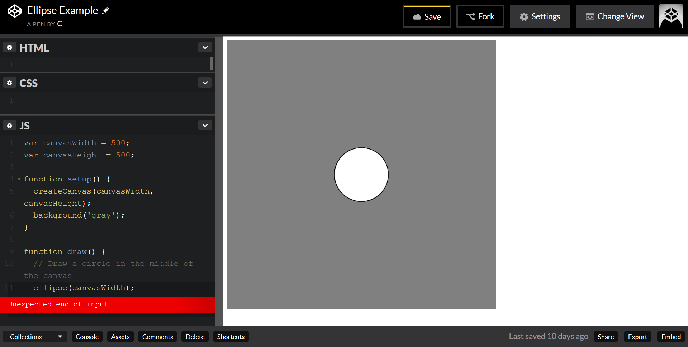

CodePen is an online text editor. It conveniently abstracts away most of the difficulty in setting up a development environment. For this reason, it is an excellent choice for beginners. This tutorial will show you how to use p5.js on the CodePen platform.


### Create a Pen

Make an account on <A HREF="http://codepen.io/">CodePen</a>. Then click "New Pen" to create your first Pen. 


The HTML, CSS, and JavaScript files that make up a basic web page will be created for you automatically. You can simply write your code in the appropriate tab. Each panel is <a href= "https://blog.codepen.io/documentation/editor/full-screen-editing/">resizable</a>. The display window, currently a blank white rectangle, shows a preview of your code's output. This preview will automatically refresh itself any time you update your code, allowing you to immediately see the results of the change.

Note that if you want to keep your new Pen, you must click the save button in the upper right hand corner. Once you have done this, CodePen will automatically save your work every thirty seconds. 

### How to Use p5.js With CodePen

p5.js is what's known as a JavaScript library. In order to use a JavaScript library on CodePen, you will need to:


<ol start="1">
  <li>Select the "Settings" tab in the top right corner of the page to bring up this menu. </li></ol>


<ol start="2">
  <li>Select the "JavaScript" option. </li></ol>


<ol start="3">
  <li>Look for the "Add External JavaScript" field. Libraries are often hosted on CDNs (Content Delivery Networks). Below I have provided two links to a CDN that hosts the libraries we need. </li></ol>
<ul>
 <li><pre>https://cdnjs.cloudflare.com/ajax/libs/p5.js/0.5.2/p5.min.js </pre></li>

 <li>
 <pre>https://cdnjs.cloudflare.com/ajax/libs/p5.js/0.5.2/addons/p5.dom.js   </pre></li></ul>
 
 P5.min.js is a compressed version of the basic p5.js library. P5.dom.js is an addon that will allow you to create sliders and buttons.

**The order in which you list the libraries is important. The addon library p5.dom requires p5.js to run, so it must be loaded after p5.js.**


<ol start="4">
  <li>Select "Save & Close."</li></ol>

### Drawing an Ellipse in CodePen

Now that you have your Pen set up, let's try to draw something. Here is a p5.js code snippet that draws a circle on a grey background: 

```
var canvasWidth = 500;
var canvasHeight = 500;

function setup() {
  createCanvas(canvasWidth, canvasHeight);
  background('gray');
}

function draw() {
  // Draw a circle in the middle of the canvas
  ellipse(canvasWidth/2, canvasHeight/2, 100,100);
}
```

Copy this snippet into the tab that says "JavaScript." 


Oh, we've got a sketch! But, it's kind of hard to see. We could scroll and squint, or resize the window panels, but it's easier to be lazy. 


Click the "Change View" tab. 


Here at the bottom we can select from multiple docking configurations for the code editor panels. Let's select the left one. 


It's much easier to see this particular sketch, now! But, what if we want to preview it full screen? 


Going back to our Change View menu, we see we have several other options. Select "Debug Mode." 


Now we can see our Pen as it will look in the browser. 

<b>As a free user, Debug Mode will only be visible to you. You will need to link others to either Full Page mode (also available from the Change View menu) or the default Editor View.</b>


This is our sketch as seen in Full Page Mode. It has a small CodePen banner but otherwise looks very similar to Debug Mode.

### Escaping From CodePen

Nice as CodePen is, we'll want to put our sketches up on our own site eventually. How can we rescue them? The export function!


Look down at the bottom right corner. 


Click "Export .zip." 


Unzip the archive, then double-click "index.html." You should see your ellipse displayed in your browser. 

**Investigating these exported files should also give some insight into how a basic webpage is put together.**

### Troubleshooting Using Your Browser

Your browser contains something called a console. (If you've programmed before, this is the browser version of a command line or terminal.) Errors and warnings that occur on a web page will be logged here, but it's hidden by default. Windows users can view it on Chrome by pressing Ctrl-Shift-J, or by  Ctrl-Shift-I and selecting the JS tab on Firefox. For Mac users, see <A href="https://www.wickedlysmart.com/hfjsconsole/">here</a>. For anything else, google "keyboard shortcut for [your browser here] console [your operating system]."


Suppose we have accidentally mangled the spelling of the p5.js function "ellipse." 


Why is there no circle? The console will usually give us some idea of what went wrong. If you click the triangle to the left of "Uncaught ReferenceError," it will expand to reveal even more information. "Elipse is not defined" should call our attention to the fact that we've made a typo. More mysterious error messages can usually be resolved by performing a Google search containing it in the search query. 

<b>You may have noticed there's a "Console" setting on the lower left side of the CodePen window. This is a simulated console and it can be sort of buggy. I would avoid using it. The real console is much more trustworthy and just as easy to use. </b>

### Troubleshooting Using CodePen

CodePen's text editor has a built in error detector. It won't catch everything, but it'll catch some things. 


Sometimes a red circle or triangle will appear. Click it and it will give you a hint as to what went wrong. 



Sometimes this can be rather vague. In this case, the trouble is that ellipse takes four inputs, but has only been provided with one. The input ended unexpectedly early because it was not given the other three.

### Tidying Using CodePen

CodePen will do its best to indent your code for you as you go, but sometimes a little manual repair is needed.


This code is functional, but a little untidy. Let's fix that. 


Click the top right menu arrow, and select "Tidy JS" from the dropdown menu.


Ta-da!

### Summary

CodePen's excellent for quickly prototyping small projects or trying out new techniques. It also makes it easy to share something with a friend or coworker--since it's already online, all you have to do is send them the link!

